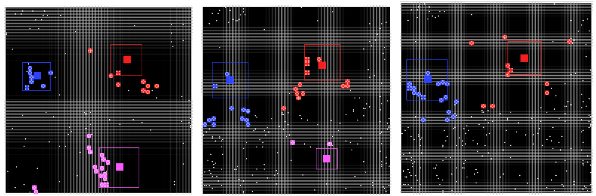
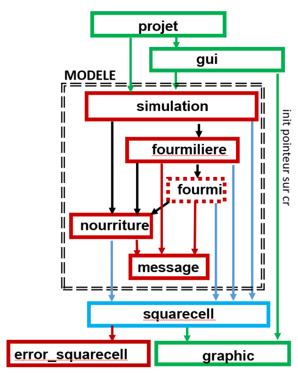

# Tchanz - Ant Colony Simulation in C++

## Project Overview
**Tchanz** is a C++ simulation that explores the competitive dynamics of **ant colonies** on a 2D grid. Multiple ant species—**Generator, Collector, Defensor, Predator**—battle over resources in real-time. The project emphasizes:

- **Object-Oriented Design (OOP)** to structure ants, colonies, and food.
- **Modularity & Scalability** through clearly separated classes and utilities.
- **Probabilistic Interactions** (random food spawns, ant births, collisions).
---

## Project Demonstration

### Simulation Snapshots  
*(Replace the placeholder image below with a relevant figure from the specifications or reports showing the grid and ants in various states.)*  



---

## Features

✔ **Multiple Ant Types** – Generator (heart of the colony), Collector (gathers food), Defensor (guards the border), Predator (eliminates other colonies’ ants).  
✔ **Colony Expansion & Contraction** – Colonies grow if they have spare resources, or shrink if they lose critical ants or run out of food.  
✔ **Collision & Predation** – Defensor ants eliminate rival Collectors upon contact; Predators jump in knight moves, hunting Collectors or opposing Predators.  
✔ **Resource Competition** – Food spawns randomly; Collectors bring it back to feed the colony.  
✔ **Probabilistic Events** – Birth rates, food spawns, and collisions are governed by random distributions.  
✔ **Robust OOP Architecture** – Each class has a single responsibility, making it easier to maintain and extend.  

---

## System Architecture & Implementation

### Main Components

#### **Simulation**
- Manages the grid, spawns new food, orchestrates each colony’s update loop.

#### **Fourmilière (Colony)**
- Stores references to all ants of that colony (Generator, Collector, Defensor, Predator).
- Manages resource stock (food) and triggers births when possible.

#### **Fourmi (Ant) – Base Class**
- **Collector** – Moves diagonally, gathers food.
- **Defensor** – Patrols colony borders, attacks rival Collectors.
- **Predator** – Moves in "knight moves" like in chess, hunts opposing Predators/Collectors.

#### **Nourriture (Food)**
- Randomly generated on the grid.
- Can be collected by a colony’s Collectors to increase resource stock.

#### **Squarecell**
- Utility or data structure representing each cell of the 2D grid (occupied, free, etc.).



---

## Simulation Flow

### **1. Initialize Simulation**
- Load configuration for grid size, number of colonies, initial ant types, and parameters.

### **2. Generate Food (Random)**
- Each iteration, a probability check spawns a new food item in a free cell.

### **3. Colony Updates**
- **Generator**: Consumes stored food, possibly spawns new ants if resources allow.
- **Collector**: Moves diagonally to find food, returns it to the colony.
- **Defensor**: Guards the perimeter, attacking any rival Collectors.
- **Predator**: Makes knight-move jumps, hunting other Predators or Collectors.

### **4. Collisions & Births**
- Ants that collide with Defensors or Predators are removed from the simulation.
- Births occur based on resource availability and random probabilities.

### **5. Cleanup**
- Remove dead ants (lifespan exceeded or destroyed).
- If the Generator dies, the colony disbands.

---
```
## 📂 Repository Structure

📦 Tchanz
 ┣ 📜 Makefile                            # Build script
 ┣ 📜 README.md                           # Project documentation
 ┣ 📜 Rapport Rendu3.pdf                  # Project report
 ┣ 📜 mysciper.txt                        # Identifier file
 ┣ 📂 src                                 # Source code for the simulation
 ┃ ┣ 📜 simulation.h / simulation.cc      # Core simulation logic
 ┃ ┣ 📜 projet.cc                         # Main project file
 ┃ ┣ 📜 fourmiliere.h / fourmiliere.cc    # Anthill (colony) class
 ┃ ┣ 📜 fourmi.h / fourmi.cc              # Base ant class
 ┃ ┣ 📜 nourriture.h / nourriture.cc      # Food representation
 ┃ ┣ 📜 squarecell.h / squarecell.cc      # Grid cell utilities
 ┃ ┣ 📜 error_squarecell.h / error_squarecell.cc  # Error handling for grid cells
 ┃ ┣ 📜 graphic.h / graphic.cc            # Graphics handling
 ┃ ┣ 📜 graphic_gui.h                     # GUI-specific graphics
 ┃ ┣ 📜 gui.h / gui.cc                    # GUI handling
 ┃ ┣ 📜 gui.h.gch                         # Precompiled GUI header
 ┃ ┣ 📜 message.h / message.cc            # Messaging system
 ┃ ┣ 📜 constantes.h                      # Constants header file
 ┃ ┣ 📜 simulation.h.gch                  # Precompiled header
 ┣ 📂 images                              # Pictures
 ┣ 📂 test_files                                # Test files for optimization

```
